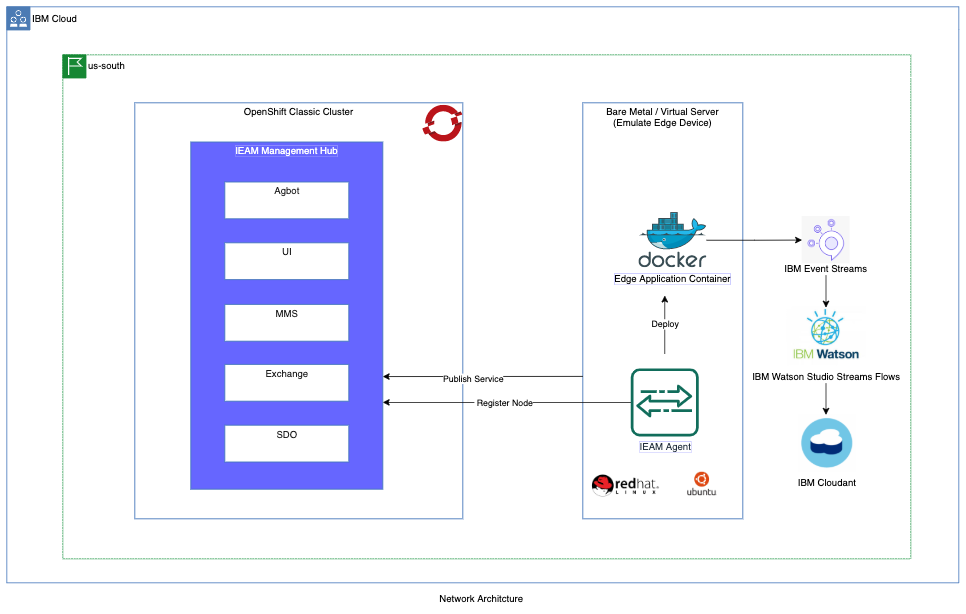

# Install the IEAM 4.2 agent

This page contains the bash commands to automate the installation of the IEAM 4.2 agent. As depicted in the figure in below, the script executes the 
following steps sequentially:

1. Publish the sample edge services such as helloworld, cpu2eventstreams, cpu and gps in multi-arch environments.
2. Install the IEAM 4.2 agent on the edge node.
3. Create an agreement in between IEAM 4.2 agent on the edge node and the agbot on the IEAM.
4. Register the edge node with the pattern **pattern-ibm.helloworld**.
5. Deploy the sample helloworld service.



## Navigation

- [Prerequisites](#prerequisites)
- [Install IEAM 4.2 agent on edge node](#install-ieam-42-agent-on-the-edge-node)

## Prerequisites

- IEAM 4.2 is already installed and agent installation files are shared and copied in your local home directory.
- Root privileges on the edge node.
- Install the following tools:
   - [make](https://www.gnu.org/software/make/)
   - [docker](https://www.ibm.com/links?url=https%3A%2F%2Fdocs.docker.com%2Fget-docker%2F)

## Install IEAM 4.2 agent on the edge node

1. Log in to your edge node using `bash` with root privileges. 
   Install [docker](https://www.ibm.com/links?url=https%3A%2F%2Fdocs.docker.com%2Fget-docker%2F)
   and run below commands to add a new user and group and switch log in to new user.

    > Note: For edge node only Linux operating system is supported.

    ```markdown
    useradd -s /bin/bash -m -d /home/ieam-dev -G sudo ieam-dev  # You are free to choose any user name and group
    usermod -g users ieam-dev
    groupadd docker
    usermod -a -G docker ieam-dev
    passwd ieam-dev
    su - ieam-dev
    ```

2. Export all the necessary environment variables.

    ```markdown
    export HZN_EXCHANGE_USER_AUTH=iamapikey:<api-key-generated-in-ieam-installation>
    export HZN_EXCHANGE_URL=<ieam-management-hub-ingress>/edge-exchange/v1  # <ieam-management-hub-ingress> is same as CLUSTER_URL, exported in IEAM Installment
    export HZN_FSS_CSSURL=<ieam-management-hub-ingress>/edge-css/   # <ieam-management-hub-ingress> is same as CLUSTER_URL, exported in IEAM installation
    export HZN_ORG_ID=iac-example-ieam-cluster    # This should be same organization id you created while Installing IEAM hub
    ```

3. Create placeholder directory **workspace** for edge resources and SFTP the files **agent-install.sh** and **agent-uninstall.sh** generated during
   IEAM 4.2 installation into **workspace** directory.

    ```markdown
    mkdir /home/ieam-dev/workspace
    cd /home/ieam-dev/workspace
    scp <your_home_dir>/workspace /home/ieam-dev/workspace   # <your_home_dir> is in your local system
    ```

4. Execute shell script `agent-install.sh` as in below. This will:
    1. Publish the sample edge services such as helloworld, cpu2eventstreams, cpu and gps in multi-arch environments.
    2. Install the IEAM agent.
    3. Create an agreement in between edge agent on the edge node and the agbot on the IEAM.
    4. Register the edge node with the pattern **pattern-ibm.helloworld**.
    5. Deploy the sample helloworld service.

    ```markdown
    sudo -s -E ./agent-install.sh -i 'css:' -p IBM/pattern-ibm.helloworld -w '*' -T 120
    ```

5. Validate the helloworld service container is running in `docker` on the edge node.

    ```markdown
    docker ps
    ```

6. (Optional) Uninstall IEAM agent from your edge node that was installed in Step 4.

    ```markdown
    ./agent-uninstall.sh -u $HZN_EXCHANGE_USER_AUTH -d
    ```

7. (Optional) Unregister your edge node that was register in Step 4. This will also stop the helloworld service.

    ```markdown
    hzn unregister -Df
    ```