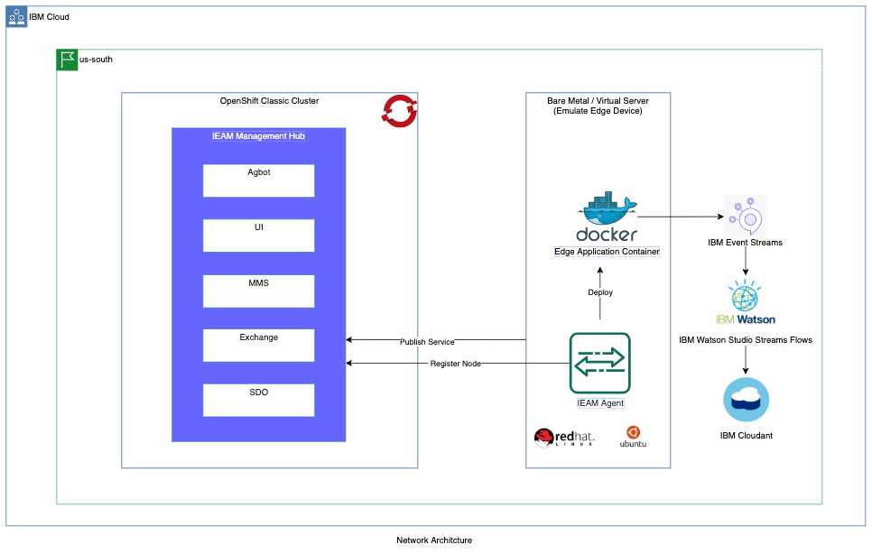

# Provision a Red Hat OpenShift Classic Cluster

This page contains the terraform and IBM schematics code to provision Red Hat OpenShift Classic cluster, Bare Metal Server, 
Virtual Server, IBM Cloudant database, and IBM Event Streams.

Below is the network architecture of the IBM Edge components produced by this project code.



## Navigation

- [Prerequisites](#prerequisites)
- [Initialize](#initialize)
- [Using Terraform](#using-terraform)
<br> or,
- (Recommended) [Using Schematics](#using-schematics)
- [Validation](#validation)

## Prerequisites

The requirements are documented in the 
[Environment Setup](https://ibm.github.io/cloud-enterprise-examples/iac/setup-environment). It includes:

- Have an IBM Cloud account with required privileges
- [Install IBM Cloud CLI](https://ibm.github.io/cloud-enterprise-examples/iac/setup-environment#install-ibm-cloud-cli)
- [Install the IBM Cloud CLI Plugins](https://ibm.github.io/cloud-enterprise-examples/iac/setup-environment#ibm-cloud-cli-plugins) 
  `infrastructure-service`, `schematics` and `container-registry`.
- [Log in to IBM Cloud with the CLI](https://ibm.github.io/cloud-enterprise-examples/iac/setup-environment#login-to-ibm-cloud)
- [Install Terraform](https://ibm.github.io/cloud-enterprise-examples/iac/setup-environment#install-terraform)
- [Configure access to IBM Cloud](https://ibm.github.io/cloud-enterprise-examples/iac/setup-environment#configure-access-to-ibm-cloud) for
  Terraform and the IBM Cloud CLI
- [Install IBM Cloud Terraform Provider](https://ibm.github.io/cloud-enterprise-examples/iac/setup-environment#configure-access-to-ibm-cloud)
- Install the following tools:
  - [IBM Cloud Pak CLI (cloudctl) and OpenShift client CLI (oc)](https://www.ibm.com/support/knowledgecenter/SSFKVV_4.2/cli/cloudctl_oc_cli.html)
  - [docker](https://www.ibm.com/links?url=https%3A%2F%2Fdocs.docker.com%2Fget-docker%2F)

> The IBM Cloud Terraform provider must be version 1.8.0 or later. This example is using Terraform version 0.12.0.

## Initialize

1. Create `workspace` directory in your local linux/mac box. Download **ieam42-automation** project code.

    ```markdown
    mkdir <your_home_dir>/workspace
    cd <your_home_dir>/workspace
    git clone https://github.com/IBM/ieam42-automation.git
    cd ieam42-automation/iac
    ```

2. Execute the commands in below to validate the ibm cloud, terraform and schematics CLI version.

    ```markdown
    ibmcloud --version
    ibmcloud plugin show infrastructure-service | head -3
    ibmcloud plugin show schematics | head -3
    ibmcloud target
    terraform version
    ls ~/.terraform.d/plugins/terraform-provider-ibm_*
    echo $IC_API_KEY
    ```

3. Create the IBM Cloud API Key as in below.

    ```markdown
    # Create a new one and export it as environment variable
    ibmcloud iam api-key-create TerraformKey -d "API Key for Terraform" --file ~/ibm_api_key.json
    export IC_API_KEY=$(grep '"apikey":' ~/ibm_api_key.json | sed 's/.*: "\(.*\)".*/\1/')
    ```

## Using Terraform

1. A sample `terraform.tfvars` file is provided with this example. This file creates resources in Dallas region in single zone. A multi-zone
sample file is available in **multizone** directory.

    > Note: Please replace the values of the variables as per your project requirement. It is advisable to not to commit `terraform.tfvars` file 
    > since it may contain sensitive information like password.**
    
    ```markdown
    project_name                             = "iac-example"
    environment                              = "dev"
    resource_group                           = "iac-example-rg"
    region                                   = "us-south"
    additional_zone_names                    = []
    public_vlan_id                           = "123456"
    private_vlan_id                          = "234566"
    enable_public_service_endpoint           = "true"
    enable_private_service_endpoint          = "true"
    additional_zone_public_service_endpoint  = []
    additional_zone_private_service_endpoint = []
    ...
    ```

2. Set the api key variables **iaas_classic_username** and **iaas_classic_api_key**. Use below command to get the value of VLAN variables
**public_vlan_id**, **private_vlan_id**, **additional_zone_public_service_endpoint** and **additional_zone_private_service_endpoint**.

    ```markdown
    ibmcloud sl vlan list -d <zone_name>
    ```

3. Execute below Terraform commands to provision the infrastructure.

    ```markdown
    terraform init  # Initialize the terraform working directory.
    terraform plan  # Create the terraform execution plan.
    terraform apply  # Apply the terraform plan to reach to the desired state.
    ```

4. Optional: In case you want to clean up the infrastructure, execute below Terraform command.

    ```markdown
    terraform destroy  # Destroy the infrastructure produced by terraform.
    ```

## Using Schematics

Schematics delivers the Terraform as a Service. Below are the steps to create and run schematics workspace to provision cloud resources.

1. A sample `workspace-workshop.json` file is provided with this example. This file creates resources in Dallas region in single zone. A multi-zone
sample file is available in **multizone** directory.

    > Note: Please replace the values of the variables as per your project requirement. It is advisable to not to commit `workspace-workshop.json` file
    > since it may contain sensitive information like password.**
    
    ```markdown
    ...
    "template_repo": {
        "url": "https://github.com/gargpriyank/ieam42-automation"
      },
      "template_data": [
        {
          "folder": ".",
          "type": "terraform_v0.12",
          "variablestore": [
            {
              "name": "project_name",
              "value": "sandbox-edge",
              "type": "string"
            },
            {
              "name": "environment",
              "value": "workshop",
              "type": "string"
            },
            {
              "name": "resource_group",
              "value": "sandbox-edge-workshop-rg",
              "type": "string"
            },
            {
              "name": "region",
              "value": "us-south",
              "type": "string"
            },
            {
              "name": "datacenter",
              "value": "dal12",
              "type": "string"
            },
            {
              "name": "machine_type",
              "value": "b3c.8x32",
              "type": "string"
            },
            {
              "name": "additional_zone_names",
              "value": "[]",
              "type": "list(string)"
            },
            {
              "name": "public_vlan_id",
              "value": "2852297",
              "type": "string"
            },
            {
              "name": "private_vlan_id",
              "value": "2852299",
              "type": "string"
            },
            {
              "name": "additional_zone_public_service_endpoint",
              "value": "[]",
              "type": "list(string)"
            },
    ...
    ```      

2. Set the api key variables **iaas_classic_username** and **iaas_classic_api_key**. Use below command to get the value of VLAN variables
**public_vlan_id**, **private_vlan_id**, **additional_zone_public_service_endpoint** and **additional_zone_private_service_endpoint**.

    ```markdown
    ibmcloud sl vlan list -d <zone_name>
    ```

3. Execute the below Schematics commands.

    ```markdown
    # Create workspace:
    ibmcloud schematics workspace list
    ibmcloud schematics workspace new --file workspace-workshop.json  # Create the new workspace.
    ibmcloud schematics workspace list  # List all the workspaces.
    
    # Create plan: 
    ibmcloud schematics plan --id $WORKSPACE_ID  # Create the schematics plan.
    ibmcloud schematics logs --id $WORKSPACE_ID --act-id Activity_ID
    
    # Apply plan:
    ibmcloud schematics apply --id $WORKSPACE_ID  # Apply the schematics plan to reach to the desired state.
    ibmcloud schematics logs  --id $WORKSPACE_ID --act-id Activity_ID
    ```

4. Optional: Execute below Schematics command to destroy the infrastructure.

    ```markdown
    ibmcloud schematics destroy --id $WORKSPACE_ID  # Destroy the cloud resources associated to the workspace.
    ibmcloud schematics logs  --id $WORKSPACE_ID --act-id Activity_ID
    
    ibmcloud schematics workspace delete --id $WORKSPACE_ID  # Delete the schematics workspace.
    ibmcloud schematics workspace list
    ```

## Validation

After the infrastructure is provisioned, validate it using one of the Terraform or Schematics commands.

1. Execute the below commands to get the Terraform output and cluster info.

    ```markdown
    terraform output
    ibmcloud ks cluster config --cluster $(terraform output cluster_id)
    ```

2. Execute the below commands to get the Schematics output and cluster info.

    ```markdown
    ibmcloud schematics workspace list          # Identify the WORKSPACE_ID
    ibmcloud schematics workspace output --id $WORKSPACE_ID --json
    
    ibmcloud ks cluster config --cluster $(ibmcloud schematics output --id $WORKSPACE_ID --json | jq -r '.[].output_values[].cluster_id.value')
    ```

3. Use below `oc` commands to verify the cluster, node and pods info.

    ```markdown
    oc cluster-info
    oc get nodes
    oc get pods -A
    ```

## Next Step

- [Install the IEAM 4.2 hub](ieam42-automation.md)